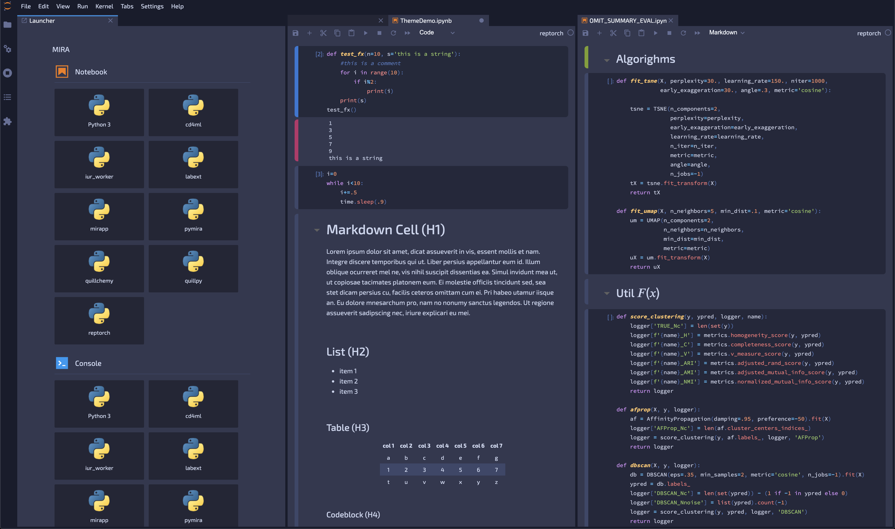

# jupyterlab_darkside_ui


Legos light ui and syntax theme for jupyterlab

## Preview


## Requirements

* JupyterLab >= 3.0

## Install
***NOTE:*** After installing and launching `jupyter lab`, the theme still needs to be enabled:
***Settings > JupyterLab Theme > @dunovank/jupyterlab_darkside_ui***

```bash
pip install jupyterlab_darkside_ui
```

### Uninstall

```bash
pip uninstall jupyterlab_darkside_ui
jupyter labextension uninstall @dunovank/jupyterlab_darkside_ui
```

> TODO
- Bring more fancy ui like in https://github.com/timkpaine/jupyterlab_miami_nights:

## Develop

### Build/Watch in Terminal 1

```bash
# Clone the repo to your local environment
# Change directory to the jupyterlab_darkside_ui directory
# Install package in development mode
pip install -e .

# Link your development version of the extension with JupyterLab
jupyter labextension develop . --overwrite

# Rebuild extension Typescript source after making changes
jlpm run build

# Watch the source directory in terminal 1
jlpm run watch
```

### Run JupyterLab in Terminal 2

```bash
jupyter lab
```

### OLD

```bash
# Build the extension and link for dev in shell 1.
jupyter labextension develop --overwrite
```

```bash
# List extensions.
jupyter labextension list
pip list | grep  jupyterlab_darkside_ui
```

```bash
# Run and watch jupyterlab in shell 1.
jlpm watch
```

```bash
# Run and watch jupyterlab in shell 2.
# Look at the remote entry javascript, a webpack5 feature.
mkdir ~/notebooks && \
  jupyter lab \
    --dev-mode \
    --watch \
    --notebook-dir=~/notebooks \
    --ServerApp.token= \
    --extensions-in-dev-mode
```

## Build

```bash
# Generate sourcemaps.
jupyter labextension build --development True .
jupyter lab build --minimize=False
```

```bash
# Do not generate sourcemaps.
jupyter labextension build .
jupyter lab build
```

## Publish

```bash
pip install jupyter_packaging twine && \
  python setup.py sdist bdist_wheel && \
  twine upload dist/*
```

```bash
jlpm build:lib && \
  npm publish --access public
```


## Contributing

### Development install

Note: You will need NodeJS to build the extension package.

The `jlpm` command is JupyterLab's pinned version of
[yarn](https://yarnpkg.com/) that is installed with JupyterLab. You may use
`yarn` or `npm` in lieu of `jlpm` below.

```bash
# Clone the repo to your local environment
# Change directory to the jupyterlab_darkside_ui directory
# Install package in development mode
pip install -e .
# Link your development version of the extension with JupyterLab
jupyter labextension develop . --overwrite
# Rebuild extension Typescript source after making changes
jlpm run build
```

You can watch the source directory and run JupyterLab at the same time in different terminals to watch for changes in the extension's source and automatically rebuild the extension.

```bash
# Watch the source directory in one terminal, automatically rebuilding when needed
jlpm run watch
# Run JupyterLab in another terminal
jupyter lab
```

With the watch command running, every saved change will immediately be built locally and available in your running JupyterLab. Refresh JupyterLab to load the change in your browser (you may need to wait several seconds for the extension to be rebuilt).

By default, the `jlpm run build` command generates the source maps for this extension to make it easier to debug using the browser dev tools. To also generate source maps for the JupyterLab core extensions, you can run the following command:

```bash
jupyter lab build --minimize=False
```
